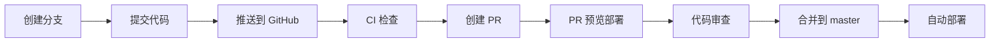

# CI/CD 配置指南

本项目使用 GitHub Actions 实现自动化部署到 Cloudflare Workers。

## 🚀 自动部署工作流

### 1. 生产环境部署 (`deploy.yml`)

**触发条件**：
- 推送到 `master` 或 `main` 分支
- 手动触发（workflow_dispatch）

**步骤**：
1. 检出代码
2. 设置 Node.js 和 pnpm
3. 安装依赖
4. TypeScript 类型检查
5. 应用数据库迁移
6. 部署到 Cloudflare Workers

### 2. PR 预览部署 (`preview.yml`)

**触发条件**：
- Pull Request 打开、同步或重新打开

**步骤**：
1. 检出代码
2. 设置 Node.js 和 pnpm
3. 安装依赖
4. TypeScript 类型检查
5. 干运行部署（验证配置）
6. 在 PR 中评论部署状态

### 3. 持续集成 (`ci.yml`)

**触发条件**：
- 推送到 `master`、`main` 或 `develop` 分支
- Pull Request 到 `master` 或 `main` 分支

**步骤**：
1. 检出代码
2. 设置 Node.js 和 pnpm
3. 安装依赖
4. TypeScript 类型检查

## ⚙️ 配置 GitHub Secrets

在使用 CI/CD 之前，需要在 GitHub 仓库中配置以下 Secrets：

### 1. 获取 Cloudflare API Token

1. 访问 [Cloudflare Dashboard - API Tokens](https://dash.cloudflare.com/profile/api-tokens)
2. 点击 **"Create Token"**
3. 使用 **"Edit Cloudflare Workers"** 模板
4. 配置权限：
   - **Account Resources**: `Cloudflare Workers Scripts:Edit`
   - **Zone Resources**: `Workers Routes:Edit`（如果使用自定义域名）
5. 继续完成创建，复制生成的 Token

### 2. 获取 Cloudflare Account ID

1. 访问 [Cloudflare Dashboard](https://dash.cloudflare.com/)
2. 选择任意站点
3. 在右侧边栏找到 **Account ID**
4. 复制 Account ID

### 3. 在 GitHub 中添加 Secrets

1. 访问你的 GitHub 仓库
2. 进入 **Settings → Secrets and variables → Actions**
3. 点击 **"New repository secret"**
4. 添加以下两个 Secrets：

| Name | Value | Description |
|------|-------|-------------|
| `CLOUDFLARE_API_TOKEN` | 你的 API Token | Cloudflare API 认证 |
| `CLOUDFLARE_ACCOUNT_ID` | 你的 Account ID | Cloudflare 账户标识 |

## 📝 配置环境变量

CI/CD 部署时会使用 Cloudflare Secrets 中配置的环境变量。

确保已在 Cloudflare 中配置以下 Secrets：

```bash
# 在本地运行以下命令
npx wrangler secret put GITHUB_CLIENT_ID
npx wrangler secret put GITHUB_CLIENT_SECRET
npx wrangler secret put GITLAB_CLIENT_ID
npx wrangler secret put GITLAB_CLIENT_SECRET
npx wrangler secret put SESSION_SECRET
npx wrangler secret put JWT_SECRET
```

## 🔄 工作流程

### 开发流程



### 部署流程

1. **本地开发**
   ```bash
   git checkout -b feature/new-feature
   # 开发...
   git add .
   git commit -m "feat: add new feature"
   git push origin feature/new-feature
   ```

2. **自动 CI 检查**
   - GitHub Actions 自动运行 CI 检查
   - 类型检查
   - 构建验证

3. **创建 Pull Request**
   - 创建 PR 到 `master` 分支
   - 预览部署自动运行
   - 检查部署状态

4. **合并和部署**
   - PR 合并后自动触发部署
   - 数据库迁移自动执行
   - 部署到生产环境

## 📊 查看部署状态

### GitHub Actions

访问仓库的 **Actions** 页面查看工作流运行状态：

```
https://github.com/lc-cn/webhook-proxy/actions
```

### 部署日志

点击具体的工作流运行查看详细日志。

### Cloudflare Dashboard

访问 Cloudflare Workers 控制台查看部署详情：

```
https://dash.cloudflare.com/[account-id]/workers/services/view/webhook-proxy
```

## 🔧 自定义配置

### 修改触发分支

编辑 `.github/workflows/deploy.yml`：

```yaml
on:
  push:
    branches:
      - master
      - main
      - production  # 添加其他分支
```

### 添加部署环境

1. 在 `wrangler.toml` 中配置环境：

```toml
[env.staging]
name = "webhook-proxy-staging"
```

2. 修改工作流：

```yaml
- name: 🚀 Deploy to Staging
  run: pnpm run deploy --env staging
```

### 添加通知

在部署成功后发送通知：

```yaml
- name: 📧 Send notification
  uses: 8398a7/action-slack@v3
  with:
    status: ${{ job.status }}
    webhook_url: ${{ secrets.SLACK_WEBHOOK }}
```

## 🐛 故障排查

### 部署失败

**问题**: API Token 权限不足

**解决**:
1. 检查 API Token 是否有正确的权限
2. 重新创建 Token 并更新 GitHub Secret

**问题**: 账户 ID 错误

**解决**:
1. 确认 `CLOUDFLARE_ACCOUNT_ID` 正确
2. 访问 Cloudflare Dashboard 重新复制

### 数据库迁移失败

**问题**: 数据库不存在

**解决**:
```bash
# 手动创建数据库
npx wrangler d1 create webhook-proxy-db
```

**问题**: 迁移冲突

**解决**:
1. 检查迁移历史
2. 手动运行迁移
3. 解决冲突后重新部署

### 类型检查失败

**问题**: TypeScript 错误

**解决**:
1. 本地运行 `pnpm run type-check`
2. 修复所有类型错误
3. 重新提交

## 📚 相关文档

- [GitHub Actions 文档](https://docs.github.com/en/actions)
- [Cloudflare Workers 部署](https://developers.cloudflare.com/workers/wrangler/ci-cd/)
- [Wrangler Action](https://github.com/cloudflare/wrangler-action)

## 🔐 安全最佳实践

1. **不要在代码中硬编码密钥**
   - 使用 GitHub Secrets
   - 使用 Cloudflare Secrets

2. **限制 API Token 权限**
   - 只授予必要的权限
   - 定期轮换 Token

3. **保护主分支**
   - 启用分支保护规则
   - 要求 PR 审查
   - 要求 CI 检查通过

4. **审计部署日志**
   - 定期检查部署记录
   - 监控异常活动

## 💡 提示

- 每次推送到 `master` 都会触发部署，请谨慎操作
- 使用 PR 流程进行代码审查
- 在本地充分测试后再推送
- 关注 GitHub Actions 执行时间配额

---

**需要帮助？** 请在 [GitHub Issues](https://github.com/lc-cn/webhook-proxy/issues) 中提问。

