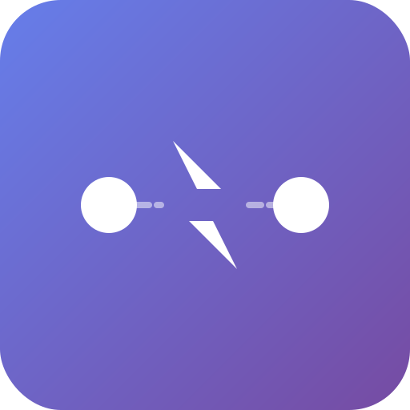

<div align="center">
  
  
  # 🚀 Webhook Proxy
  
  开源 webhook 代理服务，基于 **Hono** 框架和 **Cloudflare Workers** 构建
  
  将 webhook 事件实时转换为 WebSocket 或 SSE 事件流
  
  [](https://deploy.workers.cloudflare.com/?url=https://github.com/lc-cn/webhook-proxy)
  [](https://opensource.org/licenses/MIT)
  [](https://github.com/lc-cn/webhook-proxy)
  
  [](https://github.com/lc-cn/webhook-proxy/actions/workflows/ci.yml)
  [](https://github.com/lc-cn/webhook-proxy/actions/workflows/deploy.yml)
  
</div>

## ✨ 特性

- ⚡ **高性能架构**：
  - 统一的 Adapter 接口设计
  - 自动性能监控和日志
  - 智能错误处理和重试机制
  - 内存缓存优化数据库查询
  - 异步事件广播不阻塞响应
- 🔌 **多平台支持**：
  - 🐙 **GitHub** Webhooks（HMAC-SHA256 签名验证）
  - 🦊 **GitLab** Webhooks（HMAC-SHA256 签名验证）
  - 🤖 **QQ Bot** Webhooks（OpCode 0/13，Ed25519 签名）
  - ✈️ **Telegram** Bot Webhooks（Secret Token 验证）
  - 💳 **Stripe** Webhooks（HMAC-SHA256 签名验证）
  - ⚙️ **Jenkins** Webhooks（Token 验证）
  - 📋 **Jira** Webhooks（HMAC-SHA256 签名验证）
  - 🔍 **Sentry** Webhooks（HMAC-SHA256 签名验证）
  - 🔗 **Generic** Webhook（通用支持，接收任意第三方 Webhook）
- 🌐 **多协议支持**：WebSocket 和 SSE 实时推送
- 👤 **完整用户系统**：
  - 密码 + 邮箱注册/登录
  - GitHub/GitLab OAuth 绑定
  - Passkey (WebAuthn) 无密码登录
  - MFA (TOTP) 双因素认证
- 📧 **邮件验证**：集成 Resend 邮件服务（3000 封/月免费额度）
- 🔒 **安全认证**：
  - Webhook 签名验证（HMAC-SHA256/Ed25519）
  - Access Token 认证
  - MFA/Passkey 保护敏感信息
- ⚡ **高性能**：Cloudflare 全球边缘网络
- 💾 **持久化存储**：D1 数据库 + KV 缓存
- 🎯 **开箱即用**：精美的 Web UI 界面
- 🚀 **CI/CD 自动部署**：GitHub Actions 集成

## 🏗️ 技术栈

- **[Hono](https://hono.dev/)**: 超快速 Web 框架（13KB）
- **[Cloudflare Workers](https://workers.cloudflare.com/)**: 边缘计算平台
- **[Durable Objects](https://developers.cloudflare.com/durable-objects/)**: WebSocket 持久连接
- **[D1 Database](https://developers.cloudflare.com/d1/)**: SQLite 数据库
- **[KV Storage](https://developers.cloudflare.com/kv/)**: 键值存储
- **[Resend](https://resend.com)**: 现代邮件发送服务（3000 封/月免费）

## 🚀 快速开始

### 前置要求

- Node.js 18+
- pnpm 10+ （⚠️ 推荐使用 pnpm 10，避免 lockfile 兼容性问题）
- Cloudflare 账号（免费）

> **💡 安装 pnpm 10**: `npm install -g pnpm@10`

### 1. 克隆项目

```bash
git clone https://github.com/lc-cn/webhook-proxy.git
cd webhook-proxy
pnpm install
```

### 2. 配置环境变量

复制 `.dev.vars.example` 为 `.dev.vars`：

```bash
cp .dev.vars.example .dev.vars
```

编辑 `.dev.vars`：

```env
# OAuth 配置
GITHUB_CLIENT_ID=your-github-client-id
GITHUB_CLIENT_SECRET=your-github-secret
GITLAB_CLIENT_ID=your-gitlab-client-id
GITLAB_CLIENT_SECRET=your-gitlab-secret

# 密钥（随机生成）
SESSION_SECRET=your-random-session-secret-min-32-chars
JWT_SECRET=your-random-jwt-secret-min-32-chars

# 环境标识
ENVIRONMENT=development
```

### 3. 创建 OAuth 应用

#### GitHub OAuth App

1. 访问 [GitHub Developer Settings](https://github.com/settings/developers)
2. 创建 "OAuth App"
3. **Homepage URL**: `http://localhost:8787`
4. **Authorization callback URL**: `http://localhost:8787/auth/github/callback`
5. 保存 `Client ID` 和 `Client Secret`

#### GitLab OAuth App

1. 访问 [GitLab Applications](https://gitlab.com/-/profile/applications)
2. 创建 "Application"
3. **Redirect URI**: `http://localhost:8787/auth/gitlab/callback`
4. **Scopes**: `read_user`
5. 勾选 **Confidential**
6. 保存 `Application ID` 和 `Secret`

### 4. 初始化数据库

```bash
# 创建 D1 数据库
pnpm run db:create

# 创建 KV 命名空间
npx wrangler kv:namespace create "SESSIONS"

# 更新 wrangler.toml 中的 database_id 和 kv_namespace id

# 运行本地迁移
pnpm run db:migrate:local
```

### 5. 启动开发服务器

```bash
pnpm run dev
```

访问 http://localhost:8787 🎉

## 📋 平台配置指南

### GitHub Webhook

1. 进入仓库 Settings → Webhooks → Add webhook
2. **Payload URL**: 从 Dashboard 复制 Webhook URL
3. **Content type**: `application/json`
4. **Secret**: 从 Dashboard 复制 Webhook Secret
5. 选择需要的事件类型
6. 点击 "Add webhook"

### GitLab Webhook

1. 进入项目 Settings → Webhooks
2. **URL**: 从 Dashboard 复制 Webhook URL
3. **Secret token**: 从 Dashboard 复制 Webhook Secret
4. 选择需要的触发器
5. 点击 "Add webhook"

### QQ Bot Webhook

QQ Bot 使用 **Ed25519** 签名算法进行身份验证。

#### 1. 获取 QQ Bot 凭据

1. 访问 [QQ 开放平台](https://q.qq.com/#/app/bot)
2. 创建/选择机器人
3. 在 **开发设置** 中获取：
   - **App ID** (机器人 ID)
   - **App Secret** (密钥，用于 Ed25519 签名)

⚠️ **重要提示**：App Secret 是敏感信息，请妥善保管！

#### 2. 创建 QQ Bot Proxy

在 Dashboard 创建 Proxy 时：

- **平台**: 选择 `QQ Bot`
- **App ID**: 填入机器人的 App ID
- **Webhook Secret**: 填入 App Secret（**不是公钥**）
- **签名验证**: 建议启用

#### 3. 配置 QQ 开放平台

1. 进入机器人管理页面
2. 找到 **事件订阅** → **Webhook 方式**
3. 填写回调地址：Dashboard 中复制的 Webhook URL
4. QQ 平台会发送 OpCode 13 验证请求，系统会自动响应
5. 验证成功后，选择需要订阅的事件
6. 保存配置

#### 4. 接收 QQ Bot 事件

支持的事件类型（OpCode 0 - Dispatch）：

**公域事件：**
- `AT_MESSAGE_CREATE` - 用户 @ 机器人
- `PUBLIC_MESSAGE_DELETE` - 频道消息删除

**私域事件（需权限）：**
- `MESSAGE_CREATE` - 频道消息
- `MESSAGE_DELETE` - 消息删除
- `MESSAGE_REACTION_ADD` / `MESSAGE_REACTION_REMOVE` - 表情反应

**群聊和私聊：**
- `C2C_MESSAGE_CREATE` - 用户单聊消息
- `FRIEND_ADD` / `FRIEND_DEL` - 好友管理
- `GROUP_AT_MESSAGE_CREATE` - 群聊 @ 机器人
- `GROUP_ADD_ROBOT` / `GROUP_DEL_ROBOT` - 群机器人管理

**其他事件：**
- 频道、子频道、成员、互动、音频事件等

完整事件列表：[QQ Bot 事件文档](https://bot.q.qq.com/wiki/develop/api-v2/dev-prepare/interface-framework/event-emit.html)

#### 5. 事件数据格式

接收到的 QQ Bot 事件会被转换为统一格式：

```javascript
{
  id: '事件ID',
  platform: 'qqbot',
  type: 'AT_MESSAGE_CREATE',  // 事件类型
  timestamp: 1234567890,
  headers: { ... },
  payload: { ... },  // 原始 QQ Bot 数据
  data: {
    opcode: 0,
    event_type: 'AT_MESSAGE_CREATE',
    sequence: 42,
    event_data: { ... }
  }
}
```

#### 6. 签名验证说明

QQ Bot 使用 **Ed25519** 数字签名：

- **OpCode 13** (回调验证)：Webhook Proxy 使用 App Secret 签名响应
- **OpCode 0** (事件推送)：Webhook Proxy 验证 QQ 平台的签名

验证流程自动完成，无需手动处理。

### Telegram Bot Webhook

Telegram Bot 使用简单的 **Secret Token** 进行身份验证。

#### 1. 创建 Telegram Bot

1. 在 Telegram 中搜索 [@BotFather](https://t.me/BotFather)
2. 发送 `/newbot` 命令
3. 按提示设置机器人名称和用户名
4. 记录 **Bot Token**（格式：`123456789:ABCdefGHIjklMNOpqrsTUVwxyz`）

#### 2. 创建 Telegram Bot Proxy

在 Dashboard 创建 Proxy 时：

- **平台**: 选择 `Telegram`
- **Bot Token**: 填入从 BotFather 获取的 Token
- **Secret Token**: 可选，填写自定义的安全令牌
- **签名验证**: 建议启用

#### 3. 设置 Webhook

使用 Telegram Bot API 设置 Webhook URL：

```bash
curl -X POST "https://api.telegram.org/bot<YOUR_BOT_TOKEN>/setWebhook" \
  -H "Content-Type: application/json" \
  -d '{
    "url": "https://your-domain.com/telegram/xxxxx",
    "secret_token": "your-secret-token-if-enabled"
  }'
```

#### 4. 接收 Telegram 事件

支持的更新类型：

**消息类型：**
- `message` - 新消息
- `edited_message` - 编辑的消息
- `channel_post` - 频道消息
- `edited_channel_post` - 编辑的频道消息

**交互类型：**
- `callback_query` - 内联按钮回调
- `inline_query` - 内联查询
- `chosen_inline_result` - 选中的内联结果

**其他类型：**
- `poll` / `poll_answer` - 投票
- `my_chat_member` / `chat_member` - 成员变更
- `chat_join_request` - 入群请求

#### 5. 事件数据格式

接收到的 Telegram 事件会被转换为统一格式：

```javascript
{
  id: '事件ID',
  platform: 'telegram',
  type: 'message',  // 更新类型
  timestamp: 1234567890,
  headers: { ... },
  payload: { ... },  // 原始 Telegram Update 数据
  data: {
    update_id: 123456789,
    event_type: 'message',
    chat_id: 123456789,
    user_id: 987654321,
    message_text: 'Hello, Bot!'
  }
}
```

#### 6. Secret Token 验证

如果启用了 Secret Token：

- Telegram 会在请求头中发送 `X-Telegram-Bot-Api-Secret-Token`
- Webhook Proxy 验证该 Token 是否匹配
- 验证失败返回 401 Unauthorized

完整 Telegram Bot 文档：[https://core.telegram.org/bots/api](https://core.telegram.org/bots/api)

### Stripe Webhook

Stripe 是全球领先的支付平台，使用标准的 **HMAC-SHA256** 签名验证 Webhook。

#### 1. 创建 Stripe Proxy

在 Dashboard 创建 Proxy 时：

- **平台**: 选择 `Stripe`
- **Webhook Signing Secret**: 填入 Stripe Webhook 签名密钥（`whsec_xxx`）
- **签名验证**: 建议启用

#### 2. 获取 Webhook Signing Secret

1. 登录 [Stripe Dashboard](https://dashboard.stripe.com/)
2. 进入 **Developers** → **Webhooks**
3. 点击 **Add endpoint**
4. 填入 Webhook URL：`https://your-domain.com/stripe/xxxxx`
5. 选择要监听的事件类型
6. 创建后，点击 **Signing secret** 旁边的 **Reveal** 查看密钥
7. 复制 `whsec_xxx` 格式的密钥

#### 3. 支持的事件类型

Stripe 支持 100+ 种事件类型，常用的包括：

**支付相关：**
- `payment_intent.succeeded` - 支付成功
- `payment_intent.payment_failed` - 支付失败
- `payment_intent.canceled` - 支付取消
- `payment_intent.created` - 支付创建

**订阅相关：**
- `customer.subscription.created` - 订阅创建
- `customer.subscription.updated` - 订阅更新
- `customer.subscription.deleted` - 订阅取消
- `invoice.paid` - 发票已支付
- `invoice.payment_failed` - 发票支付失败

**退款相关：**
- `charge.refunded` - 退款完成
- `refund.created` - 退款创建
- `refund.updated` - 退款更新

**其他事件：**
- `checkout.session.completed` - Checkout 会话完成
- `customer.created` - 客户创建
- `customer.updated` - 客户更新

完整事件列表：[Stripe Event Types](https://stripe.com/docs/api/events/types)

#### 4. 接收 Stripe 事件

接收到的 Stripe 事件会被转换为统一格式：

```javascript
{
  id: 'stripe-evt_xxx',
  platform: 'stripe',
  type: 'payment_intent.succeeded',  // Stripe 事件类型
  timestamp: 1234567890,
  headers: {},
  payload: {
    id: 'evt_xxx',
    object: 'event',
    type: 'payment_intent.succeeded',
    data: {
      object: { /* PaymentIntent 对象 */ }
    },
    created: 1234567890,
    livemode: true
  },
  data: {
    event_id: 'evt_xxx',
    event_type: 'payment_intent.succeeded',
    livemode: true,
    object_type: 'payment_intent',
    object_id: 'pi_xxx',
    api_version: '2023-10-16'
  }
}
```

#### 5. 使用示例

**WebSocket 方式：**
```javascript
const ws = new WebSocket('wss://your-domain.com/stripe/xxxxx/ws?token=your_access_token');

ws.onmessage = (event) => {
  const data = JSON.parse(event.data);
  
  // 处理不同类型的 Stripe 事件
  switch (data.type) {
    case 'payment_intent.succeeded':
      const paymentIntent = data.payload.data.object;
      console.log('支付成功:', paymentIntent.id);
      console.log('金额:', paymentIntent.amount / 100, paymentIntent.currency);
      break;
      
    case 'customer.subscription.created':
      const subscription = data.payload.data.object;
      console.log('新订阅:', subscription.id);
      console.log('客户:', subscription.customer);
      break;
      
    case 'invoice.payment_failed':
      const invoice = data.payload.data.object;
      console.log('支付失败:', invoice.id);
      // 发送提醒邮件等
      break;
  }
};
```

**SSE 方式：**
```javascript
const es = new EventSource('https://your-domain.com/stripe/xxxxx/sse?token=your_access_token');

es.onmessage = (event) => {
  const data = JSON.parse(event.data);
  
  // 实时处理 Stripe 事件
  if (data.type === 'payment_intent.succeeded') {
    // 更新订单状态
    updateOrderStatus(data.payload.data.object.id, 'paid');
  }
};
```

#### 6. 签名验证机制

Stripe 使用以下机制确保 Webhook 安全：

1. **签名生成**：
   - Stripe 使用 HMAC-SHA256 算法
   - 签名字符串格式：`timestamp.payload`
   - 签名结果放在 `Stripe-Signature` 请求头

2. **签名头格式**：
   ```
   Stripe-Signature: t=1234567890,v1=signature_hex,v0=old_signature_hex
   ```

3. **验证流程**：
   - 提取时间戳 `t` 和签名 `v1`
   - 检查时间戳（防止重放攻击，5 分钟容差）
   - 重新计算签名并比较
   - 使用常量时间比较防止时序攻击

4. **测试模式**：
   - 测试环境使用 `whsec_xxx` 开头的密钥
   - 生产环境也使用相同格式的密钥
   - 两个环境的密钥不同

#### 7. 最佳实践

✅ **推荐做法：**
- 始终启用签名验证
- 使用幂等性处理（Stripe 可能重发事件）
- 快速响应 200 OK（Stripe 10 秒超时）
- 异步处理业务逻辑
- 记录所有事件用于审计

⚠️ **注意事项：**
- 不要在 Webhook 中执行长时间操作
- 事件可能乱序到达
- 同一事件可能收到多次
- 测试和生产环境使用不同的 Webhook 端点

#### 8. 测试 Stripe Webhook

**使用 Stripe CLI：**
```bash
# 安装 Stripe CLI
brew install stripe/stripe-cli/stripe

# 登录
stripe login

# 转发 Webhook 到本地（测试用）
stripe listen --forward-to https://your-domain.com/stripe/xxxxx

# 触发测试事件
stripe trigger payment_intent.succeeded
```

**使用 Stripe Dashboard：**
1. 进入 Webhooks 页面
2. 点击你的 Webhook 端点
3. 点击 **Send test webhook**
4. 选择事件类型并发送

完整 Stripe Webhooks 文档：[https://stripe.com/docs/webhooks](https://stripe.com/docs/webhooks)

### Jenkins Webhook

Jenkins 是最流行的开源 CI/CD 工具，支持灵活的 Webhook 配置。

#### 1. 创建 Jenkins Proxy

在 Dashboard 创建 Proxy 时：

- **平台**: 选择 `Jenkins`
- **Authentication Token**: 可选，填写认证令牌
- **签名验证**: 如果设置了 Token 则建议启用

#### 2. 配置 Jenkins Webhook

**方法 1：使用 Generic Webhook Trigger 插件（推荐）**

1. 安装 [Generic Webhook Trigger Plugin](https://plugins.jenkins.io/generic-webhook-trigger/)
2. 在 Jenkins Job 配置中启用 "Generic Webhook Trigger"
3. 设置 Webhook URL：
   ```
   https://your-domain.com/jenkins/xxxxx?token=your-token
   ```
   或在请求头中添加：
   ```
   Authorization: Bearer your-token
   ```

**方法 2：使用 Notification Plugin**

1. 安装 [Notification Plugin](https://plugins.jenkins.io/notification/)
2. 在 Job 配置中添加 "Job Notifications"
3. 设置 Endpoint：`https://your-domain.com/jenkins/xxxxx`
4. 选择要通知的事件（Started, Completed, Finalized）

#### 3. 支持的事件类型

Jenkins Webhook 支持多种构建事件：

**构建阶段：**
- `build.started` - 构建开始
- `build.completed` - 构建完成
- `build.finalized` - 构建最终化

**构建结果：**
- `build.success` - 构建成功
- `build.failure` - 构建失败
- `build.unstable` - 构建不稳定
- `build.aborted` - 构建中止

#### 4. 接收 Jenkins 事件

接收到的 Jenkins 事件会被转换为统一格式：

```javascript
{
  id: 'jenkins-123-xxx',
  platform: 'jenkins',
  type: 'build.completed', // 或 build.success, build.failure 等
  timestamp: 1234567890,
  headers: {},
  payload: {
    name: 'MyProject',
    url: 'https://jenkins.example.com/job/MyProject/',
    build: {
      number: 123,
      full_url: 'https://jenkins.example.com/job/MyProject/123/',
      phase: 'COMPLETED',
      status: 'SUCCESS',
      result: 'SUCCESS',
      duration: 45000,
      scm: {
        url: 'https://github.com/user/repo.git',
        branch: 'main',
        commit: 'abc123...'
      }
    }
  },
  data: {
    job_name: 'MyProject',
    job_url: 'https://jenkins.example.com/job/MyProject/',
    build_number: 123,
    build_url: 'https://jenkins.example.com/job/MyProject/123/',
    build_result: 'SUCCESS',
    build_phase: 'COMPLETED',
    build_duration: 45000,
    scm_url: 'https://github.com/user/repo.git',
    scm_branch: 'main',
    scm_commit: 'abc123...'
  }
}
```

#### 5. 使用示例

**WebSocket 方式：**
```javascript
const ws = new WebSocket('wss://your-domain.com/jenkins/xxxxx/ws?token=your_access_token');

ws.onmessage = (event) => {
  const data = JSON.parse(event.data);
  
  console.log(`[${data.data.job_name}] Build #${data.data.build_number}: ${data.data.build_result}`);
  
  if (data.data.build_result === 'FAILURE') {
    // 构建失败通知
    sendAlert(`Build failed: ${data.data.job_name} #${data.data.build_number}`);
  } else if (data.data.build_result === 'SUCCESS') {
    // 构建成功，执行部署
    triggerDeployment(data.data);
  }
};
```

**SSE 方式：**
```javascript
const es = new EventSource('https://your-domain.com/jenkins/xxxxx/sse?token=your_access_token');

es.onmessage = (event) => {
  const data = JSON.parse(event.data);
  
  // 实时显示构建状态
  updateBuildStatus({
    job: data.data.job_name,
    number: data.data.build_number,
    status: data.data.build_result,
    duration: data.data.build_duration
  });
};
```

#### 6. 最佳实践

✅ **推荐做法：**
- 使用 Token 验证保护 Webhook
- 监控关键构建任务
- 根据构建结果触发自动化流程
- 记录构建历史用于分析

⚠️ **注意事项：**
- 确保 Jenkins 可以访问 Webhook URL
- Token 可以通过 URL 参数或请求头传递
- 处理构建失败和中止情况

### Jira Webhook

Jira 是企业级项目管理和问题跟踪工具，支持丰富的 Webhook 事件。

#### 1. 创建 Jira Proxy

在 Dashboard 创建 Proxy 时：

- **平台**: 选择 `Jira`
- **Webhook Secret**: 可选，填写 Secret（用于签名验证）
- **签名验证**: 如果设置了 Secret 则建议启用

#### 2. 配置 Jira Webhook

1. 登录 Jira（管理员权限）
2. 进入 **Settings** → **System** → **WebHooks**
3. 点击 **Create a WebHook**
4. 填写信息：
   - **Name**: Webhook Proxy
   - **Status**: Enabled
   - **URL**: `https://your-domain.com/jira/xxxxx`
   - **Secret** (可选): 填写自定义密钥
   - **Events**: 选择要监听的事件
5. 保存配置

#### 3. 支持的事件类型

Jira 支持 50+ 种 Webhook 事件：

**Issue 事件：**
- `issue_created` - Issue 创建
- `issue_updated` - Issue 更新
- `issue_deleted` - Issue 删除
- `issue_assigned` - Issue 分配
- `issue_commented` - Issue 评论

**工作流事件：**
- `issue_transitioned` - 状态变更
- `issue_moved` - Issue 移动
- `issue_link_created` - 链接创建
- `issue_link_deleted` - 链接删除

**项目事件：**
- `project_created` - 项目创建
- `project_updated` - 项目更新
- `project_deleted` - 项目删除

**Sprint 事件（Jira Software）：**
- `sprint_created` - Sprint 创建
- `sprint_started` - Sprint 开始
- `sprint_closed` - Sprint 结束

完整事件列表：[Jira Webhook Events](https://developer.atlassian.com/server/jira/platform/webhooks/)

#### 4. 接收 Jira 事件

接收到的 Jira 事件会被转换为统一格式：

```javascript
{
  id: 'jira-PROJ-123-xxx',
  platform: 'jira',
  type: 'issue_updated',
  timestamp: 1234567890,
  headers: {},
  payload: {
    timestamp: 1234567890,
    webhookEvent: 'jira:issue_updated',
    issue: {
      key: 'PROJ-123',
      fields: {
        summary: 'Bug fix',
        description: '...',
        status: { name: 'In Progress' },
        issuetype: { name: 'Bug' },
        priority: { name: 'High' },
        assignee: { displayName: 'John Doe' },
        reporter: { displayName: 'Jane Smith' },
        project: { key: 'PROJ', name: 'My Project' }
      }
    },
    changelog: {
      items: [
        {
          field: 'status',
          fromString: 'To Do',
          toString: 'In Progress'
        }
      ]
    }
  },
  data: {
    event_type: 'issue_updated',
    issue_key: 'PROJ-123',
    issue_summary: 'Bug fix',
    issue_type: 'Bug',
    issue_status: 'In Progress',
    issue_priority: 'High',
    project_key: 'PROJ',
    project_name: 'My Project',
    assignee: 'John Doe',
    reporter: 'Jane Smith',
    has_changelog: true
  }
}
```

#### 5. 使用示例

**WebSocket 方式：**
```javascript
const ws = new WebSocket('wss://your-domain.com/jira/xxxxx/ws?token=your_access_token');

ws.onmessage = (event) => {
  const data = JSON.parse(event.data);
  
  switch (data.type) {
    case 'issue_created':
      console.log(`新 Issue: ${data.data.issue_key} - ${data.data.issue_summary}`);
      // 自动通知团队
      notifyTeam(data);
      break;
      
    case 'issue_updated':
      if (data.data.has_changelog) {
        // 状态变更
        console.log(`${data.data.issue_key} 状态变更为: ${data.data.issue_status}`);
      }
      break;
      
    case 'issue_commented':
      // 新评论通知
      notifyAssignee(data.payload.comment);
      break;
  }
};
```

**SSE 方式：**
```javascript
const es = new EventSource('https://your-domain.com/jira/xxxxx/sse?token=your_access_token');

es.onmessage = (event) => {
  const data = JSON.parse(event.data);
  
  // 实时更新看板
  if (data.type === 'issue_updated' && data.data.has_changelog) {
    updateKanbanBoard(data.data.issue_key, data.data.issue_status);
  }
  
  // 高优先级 Issue 提醒
  if (data.type === 'issue_created' && data.data.issue_priority === 'Critical') {
    sendUrgentAlert(data);
  }
};
```

#### 6. 签名验证机制

Jira 使用 HMAC-SHA256 签名验证：

1. **签名生成**：
   - Jira 使用配置的 Secret
   - 对整个请求体进行 HMAC-SHA256 签名
   - 签名放在请求头中

2. **签名头格式**：
   ```
   X-Hub-Signature-256: sha256=<hex_signature>
   ```
   或
   ```
   X-Atlassian-Webhook-Signature: <hex_signature>
   ```

3. **验证流程**：
   - 提取签名头
   - 使用相同的 Secret 重新计算签名
   - 使用常量时间比较防止时序攻击

#### 7. 最佳实践

✅ **推荐做法：**
- 始终启用签名验证（生产环境）
- 根据项目选择需要的事件类型
- 使用 Issue Key 作为唯一标识
- 处理状态变更时检查 changelog

⚠️ **注意事项：**
- Jira Cloud 和 Server 的 Webhook 格式略有不同
- 部分事件只在 Jira Software 或 Service Desk 中可用
- 签名验证在 Jira Cloud 中是可选的
- 测试时可以使用 Jira 的 Webhook 测试功能

### Sentry Webhook

Sentry 是领先的错误监控和性能追踪平台，使用 HMAC-SHA256 签名验证。

#### 1. 创建 Sentry Proxy

在 Dashboard 创建 Proxy 时：

- **平台**: 选择 `Sentry`
- **Client Secret**: 可选，填写 Integration 的 Client Secret
- **签名验证**: 如果设置了 Secret 则建议启用

#### 2. 配置 Sentry Webhook

**方法 1：使用 Internal Integration（推荐）**

1. 登录 Sentry，进入 **Settings** → **Developer Settings**
2. 点击 **Create New Integration** → **Internal Integration**
3. 填写基本信息：
   - **Name**: Webhook Proxy
   - **Webhook URL**: `https://your-domain.com/sentry/xxxxx`
   - **Permissions**: 根据需要设置（通常 Issue 和 Error 读权限）
   - **Webhooks**: 勾选需要的事件类型
4. 保存后获取 **Client Secret**（用于签名验证）

**方法 2：使用 Project Webhook**

1. 进入项目 **Settings** → **Webhooks**
2. 添加 Webhook URL：`https://your-domain.com/sentry/xxxxx`
3. 选择要监听的事件
4. 保存配置

#### 3. 支持的事件类型

Sentry 支持多种 Webhook 事件：

**Issue 事件：**
- `issue.created` - Issue 创建
- `issue.resolved` - Issue 解决
- `issue.assigned` - Issue 分配
- `issue.unresolved` - Issue 重新打开
- `issue.ignored` - Issue 忽略

**Error 事件：**
- `error.created` - 新错误发生
- `event.alert` - 错误告警触发

**Comment 事件：**
- `comment.created` - 评论创建
- `comment.updated` - 评论更新
- `comment.deleted` - 评论删除

完整事件列表：[Sentry Webhook Events](https://docs.sentry.io/product/integrations/integration-platform/webhooks/)

#### 4. 接收 Sentry 事件

接收到的 Sentry 事件会被转换为统一格式：

```javascript
{
  id: 'sentry-123-xxx',
  platform: 'sentry',
  type: 'issue.created',
  timestamp: 1234567890,
  headers: {},
  payload: {
    action: 'created',
    installation: { uuid: 'xxx' },
    data: {
      issue: {
        id: '123',
        title: 'TypeError: Cannot read property...',
        shortId: 'PROJ-123',
        level: 'error',
        status: 'unresolved',
        culprit: 'app/components/UserList.tsx',
        permalink: 'https://sentry.io/organizations/...',
        platform: 'javascript',
        project: {
          id: '456',
          name: 'My App',
          slug: 'my-app'
        },
        assignedTo: {
          name: 'John Doe',
          email: 'john@example.com'
        }
      }
    },
    actor: {
      name: 'Sentry',
      type: 'application'
    }
  },
  data: {
    action: 'created',
    issue_id: '123',
    issue_title: 'TypeError: Cannot read property...',
    issue_short_id: 'PROJ-123',
    issue_level: 'error',
    issue_status: 'unresolved',
    project_name: 'My App',
    project_slug: 'my-app',
    culprit: 'app/components/UserList.tsx',
    permalink: 'https://sentry.io/organizations/...',
    assigned_to: 'John Doe'
  }
}
```

#### 5. 使用示例

**WebSocket 方式：**
```javascript
const ws = new WebSocket('wss://your-domain.com/sentry/xxxxx/ws?token=your_access_token');

ws.onmessage = (event) => {
  const data = JSON.parse(event.data);
  
  switch (data.type) {
    case 'issue.created':
    case 'error.created':
      // 新错误告警
      console.log(`❌ [${data.data.issue_level}] ${data.data.issue_title}`);
      console.log(`   Project: ${data.data.project_name}`);
      console.log(`   Link: ${data.data.permalink}`);
      
      // 发送通知到 Slack/Discord
      sendAlert({
        level: data.data.issue_level,
        title: data.data.issue_title,
        url: data.data.permalink
      });
      break;
      
    case 'issue.resolved':
      // 问题已解决
      console.log(`✅ Issue resolved: ${data.data.issue_short_id}`);
      break;
      
    case 'issue.assigned':
      // Issue 被分配
      console.log(`📌 Issue assigned to ${data.data.assigned_to}`);
      notifyAssignee(data.data.assigned_to, data.data.permalink);
      break;
  }
};
```

**SSE 方式：**
```javascript
const es = new EventSource('https://your-domain.com/sentry/xxxxx/sse?token=your_access_token');

es.onmessage = (event) => {
  const data = JSON.parse(event.data);
  
  // 实时更新错误监控仪表板
  if (data.type === 'issue.created') {
    updateDashboard({
      id: data.data.issue_id,
      title: data.data.issue_title,
      level: data.data.issue_level,
      status: data.data.issue_status,
      project: data.data.project_name,
      timestamp: data.timestamp
    });
  }
  
  // 高优先级错误立即通知
  if (data.data.issue_level === 'error' || data.data.issue_level === 'fatal') {
    triggerUrgentAlert(data);
  }
};
```

#### 6. 签名验证机制

Sentry 使用 HMAC-SHA256 签名验证：

1. **签名生成**：
   - Sentry 使用 Integration 的 Client Secret
   - 对整个请求体进行 HMAC-SHA256 签名
   - 签名放在 `Sentry-Hook-Signature` 请求头

2. **签名头格式**：
   ```
   Sentry-Hook-Signature: <hex_signature>
   ```

3. **验证流程**：
   - 提取 `Sentry-Hook-Signature` 头
   - 使用相同的 Client Secret 重新计算签名
   - 使用常量时间比较防止时序攻击

4. **获取 Client Secret**：
   - Internal Integration 创建后可在详情页查看
   - 妥善保管，不要泄露

#### 7. 最佳实践

✅ **推荐做法：**
- 使用 Internal Integration（更安全、功能更强）
- 始终启用签名验证
- 根据错误级别设置不同的通知策略
- 关联 Issue ID 避免重复通知
- 记录所有错误事件用于分析

⚠️ **注意事项：**
- Internal Integration 仅对组织可见
- Project Webhook 不支持签名验证
- 高流量项目注意 Webhook 请求频率
- 测试时使用 Sentry 的测试功能

#### 8. 错误级别说明

Sentry 支持以下错误级别：

- `fatal` - 致命错误，应用崩溃
- `error` - 错误，需要立即处理
- `warning` - 警告，可能的问题
- `info` - 信息，一般性日志
- `debug` - 调试信息

**建议通知策略：**
- `fatal`/`error` → 立即通知相关人员
- `warning` → 每日汇总通知
- `info`/`debug` → 仅记录日志

完整 Sentry Webhooks 文档：[https://docs.sentry.io/product/integrations/integration-platform/webhooks/](https://docs.sentry.io/product/integrations/integration-platform/webhooks/)

### Generic Webhook（通用）

**🎯 Generic Webhook 是最灵活的选项，可以接收任何第三方服务的 Webhook！**

#### 1. 使用场景

Generic Webhook 适用于：
- 任何提供 Webhook 功能的第三方服务
- 不需要特定平台适配器的场景
- 快速集成和测试
- 自定义 Webhook 服务

支持所有内容类型：
- `application/json` - JSON 数据
- `application/x-www-form-urlencoded` - 表单数据
- `text/*` - 文本数据
- 其他任意格式

#### 2. 创建 Generic Proxy

在 Dashboard 创建 Proxy 时：

- **平台**: 选择 `Generic Webhook`
- **Authorization Token**: 可选，填写验证令牌
- **签名验证**: 建议启用（如果设置了 Token）

#### 3. 配置第三方服务

在任何支持 Webhook 的第三方服务中：

1. 找到 Webhook 配置页面
2. 填入 Webhook URL：`https://your-domain.com/generic/xxxxx`
3. 如果服务支持自定义请求头，添加：
   ```
   Authorization: Bearer your-token-here
   ```
   或直接在 URL 中添加 Token（如果服务支持）

#### 4. 接收事件

Generic Webhook 会将所有请求信息转换为标准格式：

```javascript
{
  id: '事件ID',
  platform: 'generic',
  type: 'webhook',  // 或从 payload 中提取的事件类型
  timestamp: 1234567890,
  headers: {
    'content-type': 'application/json',
    'user-agent': '...',
    // 所有请求头
  },
  payload: { /* 原始请求数据 */ },
  data: {
    method: 'POST',
    path: '/generic/xxxxx',
    query: { /* URL 查询参数 */ },
    content_type: 'application/json'
  }
}
```

#### 5. 事件类型自动推断

Generic 适配器会尝试从以下字段推断事件类型：
- `payload.event`
- `payload.event_type`
- `payload.type`
- `payload.action`
- 请求头 `X-Event-Type`
- 请求头 `X-Webhook-Event`

如果无法推断，则使用 `'webhook'` 作为默认类型。

#### 6. Token 验证

支持两种 Token 传递方式：

**方式 1：Authorization 头（推荐）**
```bash
curl -X POST https://your-domain.com/generic/xxxxx \
  -H "Authorization: Bearer your-token" \
  -H "Content-Type: application/json" \
  -d '{"event": "test", "data": "hello"}'
```

**方式 2：直接传递 Token**
```bash
curl -X POST https://your-domain.com/generic/xxxxx \
  -H "Authorization: your-token" \
  -H "Content-Type: application/json" \
  -d '{"event": "test", "data": "hello"}'
```

#### 7. 使用示例

**Stripe Webhook：**
```javascript
// Stripe 会发送 JSON 格式的事件
// Generic Webhook 自动接收并转发
// payload 包含完整的 Stripe 事件数据
```

**Custom Service：**
```javascript
// 自定义服务发送 POST 请求
fetch('https://your-domain.com/generic/xxxxx', {
  method: 'POST',
  headers: {
    'Authorization': 'Bearer your-token',
    'Content-Type': 'application/json'
  },
  body: JSON.stringify({
    event: 'order.created',
    data: { orderId: '12345' }
  })
});

// WebSocket 客户端接收：
ws.onmessage = (event) => {
  const data = JSON.parse(event.data);
  console.log('Event type:', data.type); // 'order.created'
  console.log('Payload:', data.payload);
};
```

#### 8. 最佳实践

✅ **推荐做法：**
- 始终设置 Authorization Token
- 在第三方服务中配置请求头
- 使用 HTTPS 保证安全
- 测试时先禁用签名验证

⚠️ **注意事项：**
- Generic Webhook 不验证特定平台的签名
- 仅通过 Token 进行简单认证
- 生产环境建议启用 Token 验证

## 🔄 CI/CD 自动部署

项目已配置 GitHub Actions 自动部署到 Cloudflare Workers。

### 配置步骤

1. **Fork 本仓库**

2. **配置 GitHub Secrets**

   在仓库的 Settings → Secrets and variables → Actions 中添加：

   - `CLOUDFLARE_API_TOKEN`: Cloudflare API Token
   - `CLOUDFLARE_ACCOUNT_ID`: Cloudflare Account ID

   > 详细配置说明请查看 [CI/CD 配置指南](.github/CI_CD_SETUP.md)

3. **推送代码自动部署**

   ```bash
   git push origin master
   ```

   GitHub Actions 会自动：
   - ✅ 类型检查
   - ✅ 应用数据库迁移
   - ✅ 部署到 Cloudflare Workers

### 工作流

- **CI**: 每次 Push 和 PR 都会运行类型检查
- **Preview**: PR 创建时运行预览部署验证
- **Deploy**: 合并到 master 后自动部署到生产环境

## 📦 手动部署到生产环境

如果不使用 CI/CD，可以手动部署：

### 1. 准备生产环境

```bash
# 创建生产 D1 数据库
npx wrangler d1 create webhook-proxy-db

# 创建生产 KV 命名空间
npx wrangler kv:namespace create "SESSIONS"

# 更新 wrangler.toml
```

### 2. 设置 Secrets

```bash
npx wrangler secret put GITHUB_CLIENT_ID
npx wrangler secret put GITHUB_CLIENT_SECRET
npx wrangler secret put GITLAB_CLIENT_ID
npx wrangler secret put GITLAB_CLIENT_SECRET
npx wrangler secret put SESSION_SECRET
npx wrangler secret put JWT_SECRET
npx wrangler secret put RESEND_API_KEY  # 邮件服务 API Key
```

### 3. 运行生产迁移

```bash
npx wrangler d1 migrations apply webhook-proxy-db --remote
```

### 4. 部署

```bash
pnpm run deploy
```

### 5. 配置自定义域名

1. 在 Cloudflare Dashboard 中添加 Workers 路由
2. 绑定自定义域名（如 `hooks.yourdomain.com`）

### 6. 更新 OAuth 回调 URL

将 GitHub 和 GitLab OAuth 应用的回调 URL 更新为：
- `https://hooks.yourdomain.com/auth/github/callback`
- `https://hooks.yourdomain.com/auth/gitlab/callback`

### 7. 配置邮件发送（可选）

在 Cloudflare DNS 中添加以下记录（详见 [EMAIL_SETUP.md](EMAIL_SETUP.md)）：

```
类型: TXT
名称: @
内容: v=spf1 include:relay.mailchannels.net ~all
```

```
类型: TXT
名称: _mailchannels
内容: v=mc1 cfid=your-cloudflare-account-id
```

## 📖 使用说明

### 1. 用户注册/登录

访问首页，可以通过以下方式登录：
- **用户名/邮箱 + 密码**
- **GitHub OAuth**
- **GitLab OAuth**
- **Passkey（WebAuthn）**

### 2. 创建 Webhook Proxy

登录后，在 Dashboard 页面创建新的 Proxy：

```javascript
{
  "name": "My Project",
  "platform": "github",  // 或 "gitlab"
  "webhook_secret": "your-secret",  // 可选
  "verify_signature": true  // 是否验证签名
}
```

系统会生成：
- **Webhook URL**: 用于配置在 GitHub/GitLab
- **WebSocket URL**: 客户端连接地址
- **SSE URL**: 服务端推送地址
- **Access Token**: 客户端认证令牌

### 3. 配置 Webhook

#### GitHub Webhook

1. 进入仓库 **Settings → Webhooks → Add webhook**
2. **Payload URL**: 复制 Dashboard 中的 Webhook URL
3. **Content type**: `application/json`
4. **Secret**: 与创建 Proxy 时的 `webhook_secret` 相同
5. 选择需要的事件类型
6. 点击 **Add webhook**

#### GitLab Webhook

1. 进入项目 **Settings → Webhooks**
2. **URL**: 复制 Dashboard 中的 Webhook URL
3. **Secret token**: 与创建 Proxy 时的 `webhook_secret` 相同
4. 选择需要的触发器
5. 点击 **Add webhook**

### 4. 连接客户端

#### WebSocket 客户端（浏览器）

```javascript
const token = 'your-access-token';
const ws = new WebSocket(`wss://hooks.yourdomain.com/github/your-random-key/ws?token=${token}`);

ws.onopen = () => {
  console.log('✅ 已连接');
};

ws.onmessage = (event) => {
  const data = JSON.parse(event.data);
  console.log('📨 收到事件:', data);
  
  // data.type - 事件类型（如 'push', 'pull_request'）
  // data.payload - 原始 webhook 数据
  // data.timestamp - 事件时间戳
};

ws.onerror = (error) => {
  console.error('❌ 错误:', error);
};

ws.onclose = () => {
  console.log('🔌 连接关闭');
};
```

#### SSE 客户端（浏览器）

```javascript
const token = 'your-access-token';
const eventSource = new EventSource(
  `https://hooks.yourdomain.com/github/your-random-key/sse?token=${token}`
);

eventSource.onmessage = (event) => {
  const data = JSON.parse(event.data);
  console.log('📨 收到事件:', data);
};

eventSource.onerror = (error) => {
  console.error('❌ 错误:', error);
  eventSource.close();
};
```

#### Node.js 客户端

```javascript
import WebSocket from 'ws';

const token = 'your-access-token';
const ws = new WebSocket(
  `wss://hooks.yourdomain.com/github/your-random-key/ws?token=${token}`
);

ws.on('open', () => {
  console.log('✅ 已连接');
});

ws.on('message', (data) => {
  const event = JSON.parse(data);
  console.log('📨 收到事件:', event);
});
```

## 🔒 安全特性

### MFA (Multi-Factor Authentication)

在 **Settings** 页面启用 TOTP 双因素认证：

1. 扫描二维码或手动输入密钥到认证器应用（如 Google Authenticator）
2. 输入验证码完成设置
3. 启用后，查看 Proxy 的 Secret 需要验证

### Passkey (WebAuthn)

无密码登录，更安全更方便：

1. 在 **Settings** 页面注册 Passkey
2. 使用生物识别（指纹/Face ID）或硬件密钥
3. 下次登录时直接使用 Passkey

### 邮箱验证

1. 在 **Settings** 页面设置邮箱
2. 系统发送验证码到邮箱
3. 输入验证码完成验证

### Webhook 签名验证

- **GitHub**: HMAC-SHA256 签名（`X-Hub-Signature-256` header）
- **GitLab**: 简单 Token 验证（`X-Gitlab-Token` header）

## 📊 API 文档

### 认证相关

- `GET /` - 首页（登录/注册）
- `GET /auth/github` - GitHub OAuth 授权
- `GET /auth/gitlab` - GitLab OAuth 授权
- `GET /auth/logout` - 登出
- `POST /api/account/register` - 用户注册
- `POST /api/account/login` - 用户登录

### Proxy 管理

- `GET /api/proxies` - 列出所有 Proxies
- `POST /api/proxies` - 创建新 Proxy
- `PUT /api/proxies/:id` - 更新 Proxy
- `DELETE /api/proxies/:id` - 删除 Proxy

### 安全设置

- `GET /api/security/settings` - 获取安全设置
- `POST /api/security/mfa/setup` - 设置 MFA
- `POST /api/security/mfa/verify` - 验证 MFA
- `POST /api/security/passkey/register/options` - 注册 Passkey
- `POST /api/security/passkey/login/options` - Passkey 登录

### Webhook 接收

- `POST /:platform/:randomKey` - 接收 webhook 事件

### 实时连接

- `WS /:platform/:randomKey/ws?token=xxx` - WebSocket 连接
- `GET /:platform/:randomKey/sse?token=xxx` - SSE 连接

## 💰 成本分析

### Cloudflare Workers 免费额度

| 服务 | 免费额度 | 说明 |
|------|---------|------|
| **Workers 请求** | 100,000/天 | 足够中小型应用 |
| **Durable Objects** | 1,000,000 请求/月 | WebSocket 连接管理 |
| **D1 数据库** | 5GB 存储 | 用户和 Proxy 数据 |
| **D1 读取** | 5,000,000 行/天 | 查询操作 |
| **KV 读取** | 100,000/天 | Session 管理 |
| **KV 写入** | 1,000/天 | 登录/登出 |

对于大多数个人和小型团队项目，**完全免费**！

### 升级到付费计划

如果超出免费额度，Workers Paid 计划仅需 **$5/月**：
- **10,000,000** 请求/月
- **30,000,000** Durable Objects 请求/月
- **超出部分**: $0.50/百万请求

## 🛠️ 本地开发

### 查看日志

```bash
# 实时日志
npx wrangler tail --format pretty

# 特定环境
npx wrangler tail --env production
```

### 数据库操作

```bash
# 查看表结构
npx wrangler d1 execute webhook-proxy-db --local --command ".schema"

# 执行 SQL
npx wrangler d1 execute webhook-proxy-db --local --command "SELECT * FROM users;"

# 创建新迁移
echo "ALTER TABLE users ADD COLUMN new_field TEXT;" > migrations/000X_description.sql
```

### 重置本地数据库

```bash
rm .wrangler/state/v3/d1/miniflare-D1DatabaseObject/*.sqlite
pnpm run db:migrate:local
```

## 📁 项目结构

```
webhook-proxy/
├── src/
│   ├── routes/                 # 路由模块
│   │   ├── auth.ts            # OAuth 认证
│   │   ├── account.ts         # 账户管理（注册/登录）
│   │   ├── account-settings.ts # 账户设置
│   │   ├── security.ts        # 安全设置（MFA/Passkey）
│   │   ├── api.ts             # Proxy 管理 API
│   │   ├── webhook.ts         # Webhook 处理
│   │   └── dashboard.ts       # Dashboard 路由
│   ├── pages/                  # Hono JSX 页面
│   │   ├── Home.tsx           # 首页
│   │   ├── Dashboard.tsx      # 控制面板
│   │   ├── Settings.tsx       # 设置页面
│   │   ├── About.tsx          # 关于页面
│   │   └── Docs.tsx           # 文档页面
│   ├── middleware/             # 中间件
│   │   ├── auth.ts            # 认证中间件
│   │   └── logger.ts          # 日志中间件
│   ├── adapters/               # 平台适配器（统一接口）
│   │   ├── base-cf.ts         # 适配器基类（WebhookAdapter 接口）
│   │   ├── github-cf.ts       # GitHub 适配器 (HMAC-SHA256)
│   │   ├── gitlab-cf.ts       # GitLab 适配器 (HMAC-SHA256)
│   │   ├── qqbot-cf.ts        # QQ Bot 适配器 (Ed25519)
│   │   ├── telegram-cf.ts     # Telegram Bot 适配器 (Secret Token)
│   │   ├── stripe-cf.ts       # Stripe 适配器 (HMAC-SHA256)
│   │   ├── jenkins-cf.ts      # Jenkins 适配器 (Token)
│   │   ├── jira-cf.ts         # Jira 适配器 (HMAC-SHA256)
│   │   ├── sentry-cf.ts       # Sentry 适配器 (HMAC-SHA256)
│   │   └── generic-cf.ts      # Generic Webhook 适配器 (Bearer Token)
│   ├── auth/                   # OAuth 提供者
│   │   └── oauth.ts
│   ├── db/                     # 数据库操作
│   │   ├── users.ts
│   │   ├── proxies.ts
│   │   ├── oauth-bindings.ts
│   │   └── passkeys.ts
│   ├── durable-objects/        # Durable Objects
│   │   └── webhook-connection.ts
│   ├── utils/                  # 工具函数
│   │   ├── email.ts           # 邮件发送
│   │   ├── password.ts        # 密码哈希
│   │   ├── mask.ts            # 密钥掩码
│   │   └── ed25519.ts         # Ed25519 签名验证
│   ├── types/                  # 类型定义
│   │   ├── index.ts
│   │   └── models.ts
│   ├── components/             # UI 组件
│   │   └── Layout.tsx
│   └── index.ts                # 主入口
├── migrations/                 # D1 数据库迁移
├── scripts/                    # 脚本工具
├── wrangler.toml              # Cloudflare Workers 配置
└── package.json
```

## 🎨 UI 截图

> 待添加截图

## 🤝 贡献

欢迎贡献代码！请遵循以下步骤：

1. Fork 本仓库
2. 创建特性分支 (`git checkout -b feature/AmazingFeature`)
3. 提交更改 (`git commit -m 'Add some AmazingFeature'`)
4. 推送到分支 (`git push origin feature/AmazingFeature`)
5. 开启 Pull Request

## 📝 更新日志

查看 [CHANGELOG.md](CHANGELOG.md)

## 📄 许可证

MIT License - 详见 [LICENSE](LICENSE) 文件

## 🔗 相关资源

### 文档

- [在线文档](https://hooks.zhin.dev/docs) - 完整的使用文档
- [部署指南](DEPLOYMENT.md) - Cloudflare Workers 部署详解
- [邮件配置指南](EMAIL_SETUP.md) - Resend 邮件发送配置
- [QQ Bot 指南](QQBOT_GUIDE.md) - QQ Bot 集成详细说明

### 框架和平台

- [Hono 文档](https://hono.dev/)
- [Cloudflare Workers 文档](https://developers.cloudflare.com/workers/)
- [Durable Objects 文档](https://developers.cloudflare.com/durable-objects/)
- [D1 数据库文档](https://developers.cloudflare.com/d1/)
- [Resend 邮件服务](https://resend.com/docs)

### Webhook 文档

- [GitHub Webhooks](https://docs.github.com/en/webhooks)
- [GitLab Webhooks](https://docs.gitlab.com/ee/user/project/integrations/webhooks.html)
- [QQ Bot 文档](https://bot.q.qq.com/wiki/)
- [Telegram Bot API](https://core.telegram.org/bots/api)
- [Stripe Webhooks](https://stripe.com/docs/webhooks)
- [Jenkins Webhooks](https://plugins.jenkins.io/generic-webhook-trigger/)
- [Jira Webhooks](https://developer.atlassian.com/server/jira/platform/webhooks/)
- [Sentry Webhooks](https://docs.sentry.io/product/integrations/integration-platform/webhooks/)

## 💡 使用场景

- 📱 **实时通知系统** - 将任何平台的 Webhook 事件推送到移动应用
- 🔔 **CI/CD 监控** - 实时监控 Jenkins、GitHub Actions、GitLab CI 构建状态
- 💳 **支付事件处理** - 实时接收 Stripe 支付、订阅、退款事件
- 📋 **项目管理集成** - Jira Issue 状态变更实时通知
- 🔍 **错误监控告警** - Sentry 错误实时推送，按级别自动通知
- 📊 **事件聚合** - 汇总多个服务的 webhook 事件到统一接口
- 🔄 **第三方服务集成** - Stripe、Sentry、Docker Hub 等任何支持 Webhook 的服务
- 📝 **审计日志** - 记录和分析所有 webhook 事件
- 🎯 **自动化触发** - 基于事件触发自定义工作流
- 🤖 **机器人开发** - QQ Bot、Telegram Bot 事件实时推送
- 🔗 **Webhook 调试** - 使用 Generic Webhook 快速测试和调试

## ⭐ Star History

[](https://star-history.com/#lc-cn/webhook-proxy&Date)

---

<div align="center">
  
  
  <br><br>
  
  <sub>Built with ❤️ using Hono and Cloudflare Workers</sub>
  
  <br>
  
  <sub>Designed for modern webhook proxy scenarios</sub>
  
  <br><br>
  
  **[⚡ 立即部署](https://deploy.workers.cloudflare.com/?url=https://github.com/lc-cn/webhook-proxy)** • 
  **[📖 查看文档](https://hooks.zhin.dev/docs)** • 
  **[🐛 报告问题](https://github.com/lc-cn/webhook-proxy/issues)**
</div>
